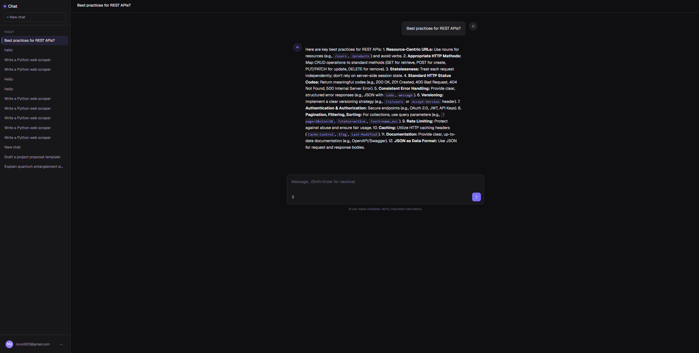

# 🤖 Chatbot

A fullstack ChatGPT-like chatbot application with real-time streaming responses, authentication, and persistent chat history.

---

## 🚀 Live Demo

🔗 https://chatbot-git-main-kseniyavldks-projects.vercel.app/

> ⚠️ **Note:** The application may require a VPN due to LLM API availability in some regions.

---

## ✨ Features

- 💬 Chat interface with **streaming AI responses**
- 🤖 Integration with **Gemini API**
- 🧠 **Persistent chat history** (stored in database)
- 📂 Left sidebar with list of chats
- 🔐 User authentication
- 👤 Anonymous users: up to **3 free questions**
- 🔄 Real-time sync between tabs
- 🖼️ Image upload in chat
- 📄 Document upload for contextual responses (**RAG**)
- ⚡ Loading states and smooth UX

---

## 🛠 Tech Stack

### Frontend

- Next.js (App Router)
- React
- TanStack Query
- Tailwind CSS
- shadcn/ui

### Backend

- Next.js API routes (REST API)

### Database

- PostgreSQL (via Supabase)

### Auth & Realtime

- Supabase Auth
- Supabase Realtime

### Deployment

- Vercel

---

## 🧱 Architecture

The project follows **strict separation of concerns**:

- **Client** → interacts only with API routes
- **Server (API)** → handles business logic and external APIs
- **Database** → accessed only via server (service role)

> ❗ No direct database calls are made from client components (including Server Components)

- Supabase is accessed securely using a **service role key**
- Public client is used only for **realtime subscriptions**

---

## 🔐 Security

- API keys are stored in **environment variables**
- No sensitive data is exposed to the client
- Anonymous usage is limited (3 free messages)

---

## 🔌 API Endpoints

| Method | Endpoint        | Description                      |
| ------ | --------------- | -------------------------------- |
| POST   | `/api/chat`     | Send message and stream response |
| GET    | `/api/chats`    | Get user chats                   |
| POST   | `/api/upload`   | Upload files                     |
| GET    | `/api/messages` | Get messages for a chat          |

---

## ⚙️ Getting Started

```bash
git clone https://github.com/kseniyavldk/chatbot.git
cd chatbot
npm install
npm run dev
```

---

## 🔑 Environment Variables

Create a `.env.local` file in the root:

```env
NEXT_PUBLIC_SUPABASE_URL=your_url
SUPABASE_SERVICE_ROLE_KEY=your_service_key

GEMINI_API_KEY=your_key
```

---

## 📸 Screenshots

```md

```

---

## 📌 Notes

- Project was built as a **test assignment**
- Focus on:
  - architecture
  - scalability
  - clean separation of layers

- Easily extendable:
  - multi-model support
  - RAG improvements
  - advanced features

---
